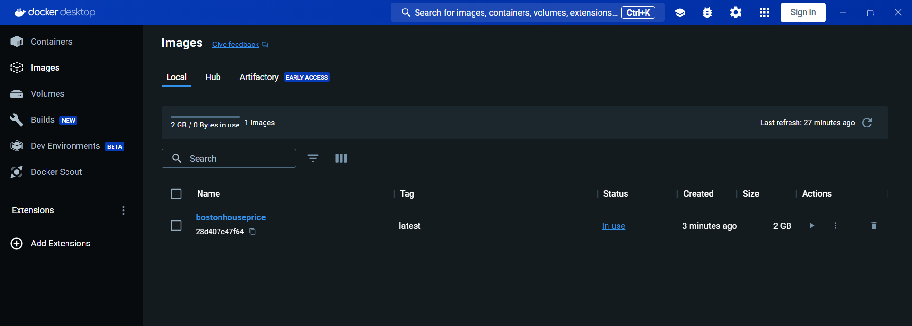
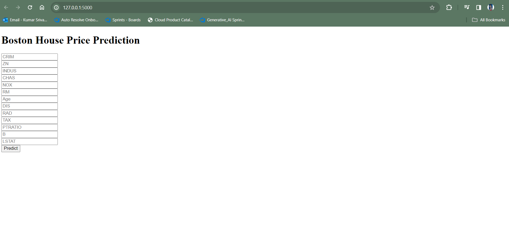

### Boston House Pricing Prediction

### Software And Tools Requirements

1. [Github Account](https://github.com)
2. [HerokuAccount](https://heroku.com)
3. [VSCodeIDE](https://code.visualstudio.com/)
4. [GitCLI](https://git-scm.com/book/en/v2/Getting-Started-The-Command-Line)

Create a new environment

```
conda create -p venv python==3.7 -y
```
# docker command used - 
- docker build -t bostonhouseprice:latest .
- docker run -dp 127.0.0.1:3000:3000 bostonhouseprice:latest

To remove image - 
- docker container remove -f /[image name]
or - docker rm -f /[image name]

# Screenshot -



